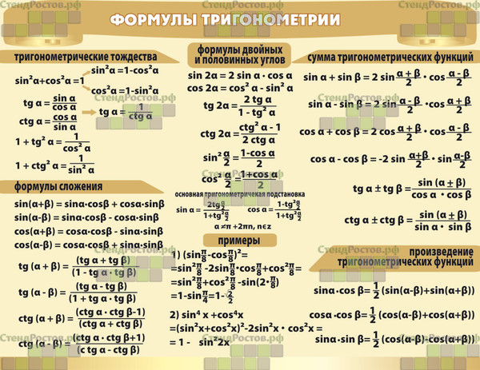

# calculus

## Доказательство предела

По доказательству предела есть супер крутая статья: *[Link](http://www.mathprofi.ru/predely_po_koshi.html)*

## Теория док-ва предела по Коши вкратце
Вообще если говорить по простому, то важно помнить вот эти две формулы
$$\forall \varepsilon>0;\exists N\in Z;|\forall n>N|;|x_n - a| < \varepsilon$$

Эта формула используется если предел стремится к нулю или бесконечности, если у нас предел стремится к конкретному числу, то формула отличается:
$$\forall \varepsilon>0;\exists \delta(\varepsilon)>0;|\forall x>:0<|x_n - x_0| < \delta(\varepsilon)$$
По сути говоря надо брать в уравнение не чему равен предел, а то к чему предел стремится. 

Само доказательство делается через уравнение. Наша задача выразить **X**.

### Примеры на доказательство предела через правило Лопиталя. 
Если что, условия использования правила Лопиталя:

- Неопределенность вида $(\frac{\infty}{\infty}\text{ or }\frac{0}{0})$
- **СУЩЕСТВОВАНИЕ ПРЕДЕЛА. Это значит что если правило применимо, то значит предел существует, очень часто можно доказать так предел**

20 задач на доказательство существования (большинство доказываются по правилу Лопиталя):

2. Докажите, что $(\(\lim_{{x \to \infty}} \frac{e^x}{x^2}\))$ существует.
   
4. Докажите, что $(\(\lim_{{x \to 0}} x\ln(x)\))$ существует.

5. Докажите, что $(\(\lim_{{x \to 0}} \frac{\sin^2(x)}{x^2}\))$ существует.

6. Докажите, что $(\(\lim_{{x \to 0}} \frac{e^x - 1 - x}{x^3}\))$ существует.

7. Докажите, что $(\(\lim_{{x \to 0}} \frac{1 - \cos(1/x)}{x}\))$ существует.

8. Докажите, что $(\(\lim_{{x \to \infty}} \frac{\sin(x)}{x}\))$ существует.

9. Докажите, что $(\(\lim_{{x \to 0}} \frac{e^x - 1 - x}{x^2}\))$ существует.

10. Докажите, что $(\(\lim_{{x \to 1}} \frac{\ln(x)}{x-1}\))$ существует.

11. Докажите, что $(\(\lim_{{x \to 0}} \frac{e^x - e^{-x}}{2x}\))$ существует.

12. Докажите, что $(\(\lim_{{x \to \infty}} \left(1 + \frac{1}{x}\right)^{2x}\))$ существует.

13. Докажите, что $(\(\lim_{{x \to 0}} \frac{x\sin(1/x)}{1 - \cos(x)}\))$ существует.

14. Докажите, что $(\(\lim_{{x \to 0}} \frac{\sin^3(x)}{x^3}\))$ существует.

15. Докажите, что $(\(\lim_{{x \to 0}} \frac{e^{1/x}}{x^2}\))$ существует.

16. Докажите, что $(\(\lim_{{x \to 0}} \frac{\tan(x)}{x}\))$ существует.

17. Докажите, что $(\(\lim_{{x \to 0}} \frac{\ln(1+x)}{x^2}\))$ существует.

18. Докажите, что $(\(\lim_{{x \to 0}} \frac{e^{2x} - 1}{x}\))$ существует.

19. Докажите, что $(\(\lim_{{x \to 0}} \frac{\sin(3x)}{x}\))$ существует.

20. Докажите, что $(\(\lim_{{x \to 0}} \frac{x^2\ln(1+x)}{x^3 + 1}\))$ существует.

**Хорошие примеры из учебника**

- $\lim_{n \to \infty}{\frac{3n}{2n+1}} = \frac{3}{2} $
- $\lim_{n \to \infty}{\sqrt{n+1}-\sqrt{n}} = 0$

## Пределы
Примеры:
1. Найти $\(\lim_{{x \to 0}} \frac{\sin(3x)}{x}\)$.

2. Вычислить $\(\lim_{{x \to 0}} \frac{e^{2x} - 1}{x}\)$.

3. Найти $\(\lim_{{x \to 0}} \frac{x^2 - \sin(x^2)}{x^4}\)$.

4. Вычислить $\(\lim_{{x \to 0}} \frac{\tan(2x)}{x^3}\)$.

5. Найти $\(\lim_{{x \to 0}} \frac{\ln(1+x) - \sin(x)}{x^2}\)$.

6. Вычислить $\(\lim_{{x \to 0}} \frac{e^x - e^{-x}}{x^2}\)$.

7. Найти $\(\lim_{{x \to 0}} \frac{\cos^2(x) - 1}{x^4}\)$.

8. Вычислить $\(\lim_{{x \to 0}} \frac{e^x - \sqrt{1+x}}{x^2}\)$.

9. Найти $\(\lim_{{x \to 0}} \frac{\ln(1+2x) - 2\ln(1+x)}{x^2}\)$.

10. Вычислить $\(\lim_{{x \to 0}} \frac{x^3 - \tan^3(x)}{x^7}\)$.

**Хорошие примеры из учебника**

- $\lim_{n \to \infty} {\frac{1000n}{2n+1}}$
- $\lim_{n \to \infty} {\frac{\sqrt{n}-9}{n+3}}$
- $\lim_{n \to \infty} {\frac{4n^2-5n-1}{7+2n-8n^2}}$
- $\lim_{n \to \infty} {\frac{5n^2+3n+1}{n^3+n^2+5}}$
- $\lim_{n \to \infty} {(1+\frac{5}{n})}^{n}$
- $\lim_{n \to \infty} {(1+\frac{1}{4n})}^{8n}$
- $\lim_{n\to{\infty}}{\sqrt[{n}]{n^{3}+3^{n}}}$
- $\(\lim_{{n \to \infty}} \sqrt[n]{n^4+4^n}\)$
- $\(\lim_{{n \to \infty}} \sqrt[n]{n^2+2^n}\)$
- $\(\lim_{{n \to \infty}} \sqrt[n]{n^5+5^n}\)$
- $\(\lim_{{n \to \infty}} \sqrt[n]{n^6+6^n}\)$
- $\lim_{n \to \infty} {\sqrt{n+2} - 2\sqrt{n+1} +\sqrt{n}}$

# Производные

Таблица производных:

| Function Value          | Derivative             |
|------------------------|------------------------|
| $\(a\)$                  | $\(0\)$                  |
| $\(x\)$                  | $\(1\)$                  |
| $\(x^n\)$                | $\(n \cdot x^{n-1}\)$    |
| $\(e^x\)$                | $\(e^x\)$                |
| $\(a^x\)$                | $\(a^x \cdot \ln(a)\)$   |
| $\(\ln(x)\)$             | $\(\frac{1}{x}\)$       |
| $\(\log_a(x)\)$          | $\(\frac{1}{x \cdot \ln(a)}\)$ |
| $\(\sin(x)\)$            | $\(\cos(x)\)$            |
| $\(\cos(x)\)$            | $\(-\sin(x)\)$           |
| $\(\tan(x)\)$            | $\(\sec^2(x)\)$           |
| $\(\csc(x)\)$            | $\(-\csc(x) \cdot \cot(x)\)$ |
| $\(\sec(x)\)$            | $\(\sec(x) \cdot \tan(x)\)$ |
| $\(\cot(x)\)$            | $\(-\csc^2(x)\)$          |

Операции с производными:

| Operation           | Derivative                                      |
|---------------------|------------------------------------------------|
| $\(u(x) + v(x)\)$    | $\(u'(x) + v'(x)\)$                             |
| $\(u(x) - v(x)\)$    | $\(u'(x) - v'(x)\)$                             |
| $\(u(x) \cdot v(x)\)$| $\(u(x) \cdot v'(x) + u'(x) \cdot v(x)\)$       |
| $\(\frac{u(x)}{v(x)}\$| $\(\frac{u'(x) \cdot v(x) - u(x) \cdot v'(x)}{(v(x))^2}\)$ |

Еще неплохо было бы помнить как раскладывать многоэтажные дроби (я постоянно забываю):

$\frac{\frac{a}{b}}{\frac{c}{d}}=\frac{ad}{bc}$

И обязательно повторить все тригонометрические формулы:

## Хорошие примеры из учебника

- $y=x^3-3\sqrt{x}+\frac{2}{x}+5$
- $y=3sinx-5cosx$
- $y=xlnx$
- $y=x^2log_2(x)+ln3$
- $y=\frac{1+sinx}{1+cosx}$
- $y=\frac{lnx}{x}$
- $y=(x^2+1)(3x-1)(1-x^3)$
- $y=(\sqrt{x}+1)(\frac{1}{\sqrt{x}}-1)$
- $y=\sqrt{x}tanx+cotx$
- $y=\frac{e^x}{x^2}+ln2$
- $y=ln(x+\sqrt{a^2+x^2})$
- $y=e^{arctan{\sqrt{x}}} + 2^{x^2}$
- $y=ln(\sqrt{\frac{1-sin2x}{1+sin2x}})$
- $y=sin[sin(sinx)]$
- 

# Производные высших порядков

Формула для нахождения производной второго порядка функции \(f(x)\) выглядит следующим образом:

$$ \[f''(x) = \frac{d^2}{dx^2}f(x)\]$$

## Формула Лейбца

Чтобы было легче найти производные высших порядков в функции вида $uv$:
Формулы для вычисления производных 1-го, 2-го и 3-го порядка произведения функций \(f(x)\) и \(g(x)\) с использованием формулы Лейбница в LaTeX:

1. Первая производная:
$$\[(fg)'(x) = f'(x)g(x) + f(x)g'(x)\]$$

2. Вторая производная:
$$\[(fg)''(x) = f''(x)g(x) + 2f'(x)g'(x) + f(x)g''(x)\]$$

3. Третья производная:
$$\[(fg)'''(x) = f'''(x)g(x) + 3f''(x)g'(x) + 3f'(x)g''(x) + f(x)g'''(x)\]$$

**Примеры**
Найти производную второго порядка:

- $y = 2x^2 + lnx$
- $y = e^{1-2x}$
- $y =e^{-x}cosx$
- $y = ln(x+\sqrt{1+x^2})$

Найти производную n порядка:

- $y = xlnx$
- $y = \frac{1-x}{1+x}$
